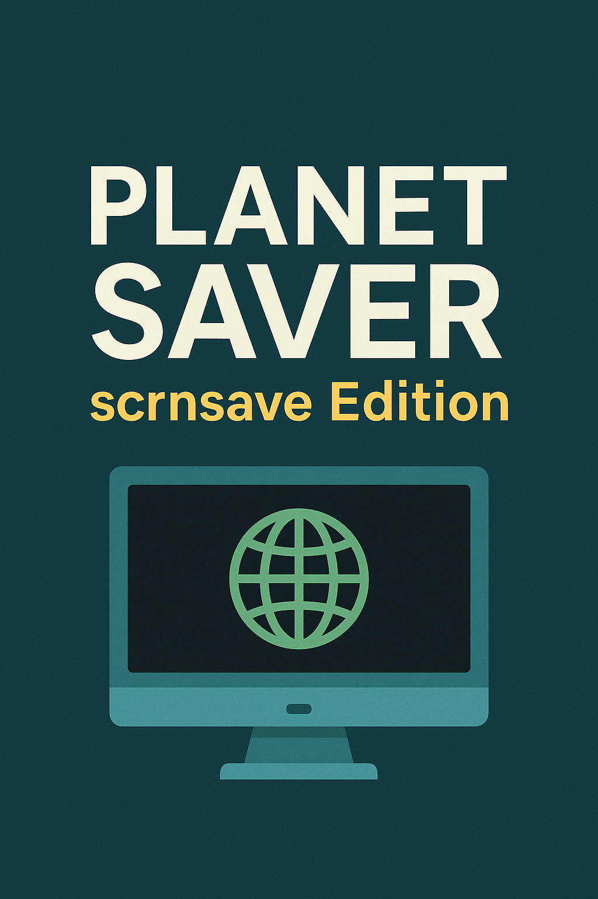

# Planet Saver: scrnsave Edition

 _Ein radikal minimalistisches Energiespar-Toolkit für Windows._  
 **CI-Schachmatt. Release-Schachmatt. Welt retten?** Natürlich.




 **Kurzfassung:** Dieses Repo startet den Windows-Bildschirmschoner mit einer (hust) hochoptimierten Ein-Zeilen-Magie:

 ```powershell
 powershell.exe -command "scrnsave.scr"
 ```

 Ergebnis: Der Bildschirm geht aus – und dein Energiespar-Gewissen an.  
 Ernsthaft genug, um in ein Portfolio zu passen. Ironisch genug, um Spaß zu machen.

---

## Inhaltsverzeichnis

- [Features](#features)
- [Installation](#installation)
  - [A: Klonen & lokal ausführen](#a-klonen--lokal-ausführen)
  - [B: Release herunterladen (ohne Git)](#b-release-herunterladen-ohne-git)
  - [C: Optional – Signatur/ExecutionPolicy](#c-debugging)
  - [D: Stream Deck Integration (Elgato)](#d-stream-deck-integration-elgato)
- [Benutzung](#benutzung)
- [Automatisierung (Windows Aufgabenplanung)](#automatisierung-windows-aufgabenplanung)
- [Entwicklung](#entwicklung)
- [Warum das (angeblich) den Planeten rettet](#warum-das-angeblich-den-planeten-rettet)
- [Roadmap](#roadmap)
- [Lizenz](#lizenz)

---

## Features

- 🖥️ **Ein Befehl, dunkler Bildschirm** – nutzt den Windows-Standard‐Screensaver `scrnsave.scr`.
- 🧪 **CI bereit** – Linting mit PSScriptAnalyzer in GitHub Actions.
- 📦 **Release-Pipeline** – ZIP-Artefakt bei `vX.Y.Z`-Tags.
- 🧰 **Stream Deck-fertig** – ein Klick, Bildschirm aus.
- 😎 **Portfolio-tauglich** – professioneller Aufbau, aber mit Augenzwinkern.

---

## Installation

### A: Klonen & lokal ausführen

```powershell
git clone https://github.com/FinnGrndl/planet-saver-scrnsave.git
cd planet-saver-scrnsave
pwsh ./src/TurnOffScreen.ps1
````

### B: Release herunterladen (ohne Git)

1. Gehe auf die **Releases-Seite** des Repos:
   [https://github.com/FinnGrndl/planet-saver-scrnsave/releases](https://github.com/FinnGrndl/planet-saver-scrnsave/releases)
2. Lade das **neueste ZIP** herunter.
3. **Entpacke** das ZIP in einen Ordner deiner Wahl.
4. **Führe** das Skript aus:

   ```powershell
   pwsh ./src/TurnOffScreen.ps1
   ```

### C: Debugging

Falls Windows das Skript blockiert:

```powershell
# Nur einmal nötig:
Unblock-File ./src/TurnOffScreen.ps1

# Oder Policy temporär lockern:
pwsh -ExecutionPolicy Bypass -File ./src/TurnOffScreen.ps1
```

### D: Stream Deck Integration (Elgato)

1. Öffne die **Stream-Deck-App**.
2. Füge die Aktion **System → Programm öffnen** hinzu.
3. **Programm:** Pfad zu PowerShell 7 (`pwsh.exe`), z. B.:

   ```
   C:\Program Files\PowerShell\7\pwsh.exe
   ```
4. **Argumente:**

   ```
   -NoProfile -ExecutionPolicy Bypass -File "C:\Pfad\zu\planet-saver-scrnsave\src\TurnOffScreen.ps1"
   ```
5. **Titel/Icon:** Nach Wunsch (z. B. „Screen Off“).
6. Taste drücken → Bildschirm geht schlafen.

*Tipp:* Man kannst auch direkt `C:\Windows\System32\scrnsave.scr` als Programm setzen – die PowerShell-Variante ist robuster.

---

## Benutzung

```powershell
# Schnelltest:
pwsh ./src/TurnOffScreen.ps1

# Direkt (ohne Repo):
powershell.exe -command "scrnsave.scr"
```

---


## Automatisierung (Windows Aufgabenplanung)

```powershell
$script = (Resolve-Path ./src/TurnOffScreen.ps1).Path
$action = New-ScheduledTaskAction -Execute "pwsh.exe" -Argument "-NoProfile -ExecutionPolicy Bypass -File `"$script`""
$trigger = New-ScheduledTaskTrigger -AtLogOn
Register-ScheduledTask -Action $action -Trigger $trigger -TaskName "PlanetSaverScrn" -Description "Startet den Bildschirmschoner beim Anmelden"
```

---

## Entwicklung

* **Linting:** PSScriptAnalyzer (CI).
* **CI:** `.github/workflows/ci.yml` prüft Linting + Smoke-Test.
* **Release:** `.github/workflows/release.yml` baut ZIP bei Tags `v*.*.*`.

---

## Warum das (angeblich) den Planeten rettet


* **Null Kontextwechsel:** Ein Befehl, Bildschirm aus.
* **Skalierbar:** Millionen Windows-Clients.
* **Messbar:** Display aus → weniger Strom → weniger Emissionen.
* **DevOps-fähig:** Energiesparen verdient CI/CD.

---

## Roadmap

* [ ] Optionaler Hard-Display-Off via Win32-API
* [ ] CLI-Flags (z. B. `--delay 5s`)
* [ ] Tray-Icon mit „Jetzt abdunkeln“

---

## Lizenz

MIT – siehe [LICENSE](./LICENCE).

````
